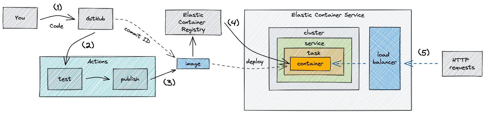
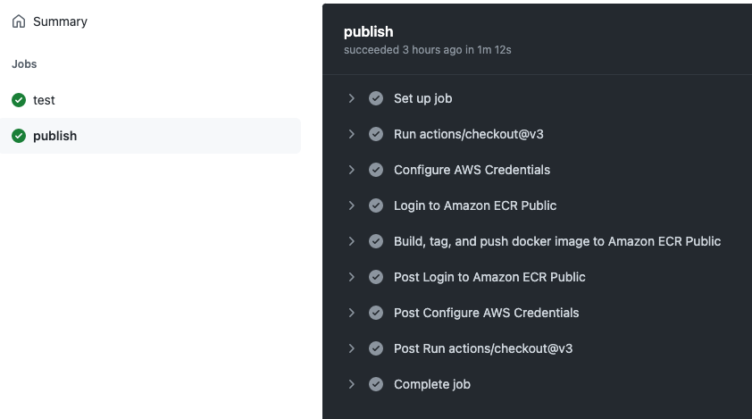

# Docker & Cloud Deployment

In this project, you'll build a simple Go server application and Dockerise it to run within a container. You'll write tests that run against the container, and then build GitHub actions automate continuous testing and release of the application. You'll then run it in the cloud by pushing the container image to Amazon AWS Elastic Container Repository, and then launch it in Amazon AWS Elastic Container Service using the user interface.

> ⚠️ This project requires you to have access to an Amazon AWS account, with permissions to configure ECS, ECR, Fargate, and Elastic Load Balancing. Ask on CYF Slack for help with that.

Learning objectives:

- Det up Docker locally
- `Dockerfile` syntax & how to containerise an application
- Run applications locally using Docker
- Push container images to a repository ([ECR](https://aws.amazon.com/ecr/))
- Deploy images to Elastic Cloud resources using Elastic Container Service
- Destroy cloud resources to mitigate cost

Timebox: 2 days

## Project

This project will require us to pull together information from several different guides to get an application developed locally to run in the cloud. This project will give you experience of building and deploying a real applications. Our focus here is **not** on the Go code, but on the infrastructure around it.

> **Important:** You will need a GitHub repo to complete this becase we'll be using [GitHub Actions](https://docs.github.com/en/actions). If you are not already working in the `immersive-go-course` repository, now would be a good time!

### Motivation

We're going to build a simple Go server, and then _containerise_ it.

> In this project, we'll use the terms containerise and dockerise interchangeably to mean the same thing: making an application run in a container using Docker.

A container is a "sandboxed" process on your computer that is isolated from all other processes, unless specifically allowed.

When running a container, it uses an isolated filesystem. This filesystem is provided by a container image. Since the image contains the container’s filesystem, it must contain everything needed to run an application - all dependencies, configurations, scripts, binaries, etc. The image also contains other configuration for the container, such as environment variables, a default command to run, and other metadata.

When you combine images and containers, we can package whole applications in way that is transferrable (we can create them completely separately from running them) and highly reproducible. Both of these are very important in a production environment.

The isolation and security allows you to run many containers simultaneously on a given host. Containers are lightweight and contain everything needed to run the application, so you do not need to rely on what is currently installed on the host. You can easily share containers while you work, and be sure that everyone you share with gets the same container that works in the same way.

To summarize, a container:

- is a runnable instance of an image. You can create, start, stop, move, or delete containers
- can be run on local machines, virtual machines or deployed to the cloud
- is portable (can be run on any OS)
- is isolated from other containers and runs its own software, binaries, and configurations

## Background

### Docker

Docker is an open platform for developing, shipping, and running applications, based around containers and images. Docker provides tooling and a platform to manage the lifecycle of your containers:

- Develop your application and its supporting components using containers
- The container becomes the unit for distributing and testing your application.
- When you’re ready, deploy your application into your production environment, as a container or an orchestrated service. This works the same whether your production environment is a local data center, a cloud provider, or a hybrid of the two.

Read [this guide to get an overview of Docker](https://docs.docker.com/get-started/overview/).

To build hands-on familiarity with Docker, complete parts 1, 2 and 3 of [this tutorial](https://docs.docker.com/get-started/), after which you should know about:

- Running applications with docker: `docker run -dp 80:80 docker/getting-started`
- Containers and images: process & filesystem isolation
- `Dockerfile`: a text-based script of instructions that is used to create a container image
- Starting, managing processes and images: `docker ps` and `docker rm -f`s

Next work through the [Go Docker tutorial](https://docs.docker.com/language/golang/), after which you should know about:

- Dockerising a go application
- Starting and stopping containers
- Volumes & networking between docker containers
- Basics of docker-compose and CockroachDB
- GitHub actions for pushing the image to Docker Hub

Spend some time on these steps, and feel free to complete other tutorials too. It's very important to grasp the core ideas of containers, images and docker:

- Docker is a set of tools for managing containers and images
- Images are frozen file systems that hold everything a container needs to run
- Containers are your running application, based on an image

### Cloud hosting in AWS

We're going to host our application in the cloud, specifically in Amazon Web Services (AWS). AWS is a large suite of products for running technology in the cloud.

The set of AWS products we're going to interact with directly are:

- Elastic Container Repository (ECS): store images that can later be run as containers
- Elastic Container Service (ECR): run containers, including all the infrastructure needed to make them accessible to the internet
- Identity & Access Management (IAM): manage security, identity and access within AWS

To get familiar with ECS, run through the [AWS tutorial](https://aws.amazon.com/getting-started/hands-on/deploy-docker-containers/), after which you should know about:

- Container & task: like a blueprint for your application
- Service & load balancing: launches and maintains copies of the task definition in your cluster
- Cluster: compute resources used to run the service & load balancing

## Building & Dockerising server

The rest of this project will cover putting this all together to run an application that we've written on Elastic Container Service. The steps will be:

- Build a simple Go server
- Dockerise it to run locally within a container
- Write tests that run against the docker container
- Build GitHub actions automate CI/CD
- Push the image to ECR
- Launch it in ECS using the UI

Make sure to commit code as you work with clear messages. We are going to work in a tight loop with GitHub — pushing code and testing it — so [good Git hygiene](https://betterprogramming.pub/six-rules-for-good-git-hygiene-5006cf9e9e2) is important.

## Server

Write a simple server in Go with this behaviour when you `go run` it:

```console
> curl localhost:8090
Hello, world.

> curl localhost:8090/ping
pong
```

Make sure that the port is configurable with an environment variable `HTTP_PORT`, and defaults to port `80`.

### Dockerise

Write a `Dockerfile` for the application. Optionally, make this a bit harder by including a multi-stage build.

It should build & run like this:

```console
> docker build . -t docker-cloud
[+] Building 22.6s (15/15) FINISHED
...

> docker run -dp 8090:80 docker-cloud
306cf309f3970d5380cd07c3a54aead7ee8cf4f6726b752fecaec39e40da69f5

> curl localhost:8090
Hello, world.

> curl localhost:8090/ping
pong
```

### Tests

Write some simple tests for your server. For writing tests, we'll use [dockertest](https://github.com/ory/dockertest).

The principle of `dockertest` is to test against real running services, end to end, in containers. The advantage is that these services can be destroyed after testing and recreated from scratch, so that the tests are highly reproducible.

Following [docs here](https://github.com/ory/dockertest) and [example here](https://github.com/olliefr/docker-gs-ping), write some tests.

Go dependencies are installed by `go get`.

Make sure to `COPY go.sum ./` in your `Dockerfile`. [Read this guide to understand why](https://golangbyexample.com/go-mod-sum-module/).

## CI/CD

A set of good practices has exists for developing software for production use by thousands or millions of people. One example of this is Continuous Integration & Continuous Deployment, referred to as CI/CD. We're going to focus on the "CI" component of this, which means:

- working with version control (Git)
- running automated checks on the code added to Git (specifically, test)
- automating the steps required to "build" a version of the application that could be deployed to production (specifically, building a Docker image and pushing it to a shared repository)

This automation runs in the cloud — _not_ on developer laptops — so that it is highly reproducible and the same for whoever writes the the code. The idea is that, should the tests fail, the code will not be built or pushed to the repository, so it's harder to push buggy code to production.

### Github Action: running tests

The system we'll use for CI testing and image creation is [GitHub Actions](https://docs.github.com/en/actions).

Follow [this guide on GitHub](https://docs.github.com/en/actions/automating-builds-and-tests/building-and-testing-go) to get a GitHub action testing the code.

You'll be adding a single file to the `.github/workflows` directory of the repo.

Pay attention to the following:

```yml
# Make sure that the working directory for the tests is correct
defaults:
  run:
    working-directory: docker-cloud
```

And:

```yml
# Use the right go version file and dependency path
# Note that these are *not* subject to the working-directory defaults
- name: Set up Go
  uses: actions/setup-go@v3
  with:
    go-version-file: "docker-cloud/go.mod"
    cache-dependency-path: "docker-cloud/go.sum"
    cache: true
```

### Github Action: publish image

Next, we're going build an action that creates and pushes the image to AWS Elastic Container Registry.

The end result will work something like this, including the steps that follow to deploy the container to Elastic Container Service (ECS):



1. You (the developer) push code to GitHub
2. GitHub triggers Actions that run against your code
3. After running tests, an Action creates and publishes a Docker image to the Elastic Container Registry, identified by the [commit ID](https://git-scm.com/book/en/v2/Git-Basics-Viewing-the-Commit-History)
4. Via the ECS UI, we will deploy this image as a container (which will also create a task, service, cluster and load balancer, amongst other things)
5. Finally, our server will be able to receive HTTP requests from anyone on the internet!

We've already managed steps 1 and 2.

Step three requires us to do the following:

- We need a repository on ECR where we'll publish our images. A repository is a collection of images. Ours will be **public**. We'll create this via the ECR user interface.
- We need to **authorise** GitHub to push images to our repository. We don't want _anyone_ to be able to push images. Just us. We'll do this by creating an Identify Provider, two Policies, and a Role, plus making use of some standard [AWS GitHub actions](https://github.com/aws-actions).

Here are the steps: figuring out the gaps is up to you. The [guide here](https://benoitboure.com/securely-access-your-aws-resources-from-github-actions) may be helpful to you, as well as [this guide on creating policies](https://docs.aws.amazon.com/IAM/latest/UserGuide/access_policies_create-console.html).

1. [Create a repository](https://eu-west-1.console.aws.amazon.com/ecr/repositories?region=eu-west-1). Make sure it's public.
   <br>Make a note of the URI of the registry — something like `public.ecr.aws/w0k4j6h5/immersive-go-course/docker-cloud`. The alias (`w0k4j6h5`) and name `immersive-go-course/docker-cloud` will be useful later.
1. Via the IAM dashboard (use the AWS navigation to find this):
   1. Add a new OpenID Connect Identify Provider
      - Provider URL: `https://token.actions.githubusercontent.com` (Don't forget to click Get Thumbprint)
      - Audience: `sts.amazonaws.com`
   1. Create two Policies, which will allow the Role to push Docker images:
      1. Call the first Policy `GetAuthorizationToken`, and set it up to:
         - `GetAuthorizationToken` against the `Elastic Container Registry Public` service
         - `GetServiceBearerToken` against the `STS` service
      1. Call the second Policy `AllowPush`, and set it up with the following against the `Elastic Container Registry Public` service:
         - Read `BatchCheckLayerAvailability`
         - Write `CompleteLayerUpload`, `InitiateLayerUpload`, `PutImage`, `UploadLayerPart`
   1. Create a Role called `GitHubActionECRPublicPushImage`:
      - Chose Web Identity, select the Identity provider you created in the previous step, and its audience
      - Assign the `GetAuthorizationToken` and `AllowPush` policies to the Role
   1. After you've created the role, edit it. In the Trust Relationships tab, update the `"Condition"` block so that it references **your repository**:
      ```json
      "Condition": {
          "StringEquals": {
              "token.actions.githubusercontent.com:aud": "sts.amazonaws.com"
          },
          "StringLike": {
              "token.actions.githubusercontent.com:sub": "repo:[YOUR_GITHUB_USERNAME]/[YOUR_GITHUB_REPO]:*"
          }
      }
      ```

We're now ready to create the GitHub Actions. We're going to use two actions, in order:

1. [aws-actions/configure-aws-credentials](https://github.com/aws-actions/configure-aws-credentials)
2. [aws-actions/amazon-ecr-login](https://github.com/aws-actions/amazon-ecr-login)

Make sure that the action has a `write` token:

```yml
permissions:
  id-token: write
```

And that you have correctly copied the Amazon Resource Name (ARN) for the Role you created:

```yml
- name: configure aws credentials
  uses: aws-actions/configure-aws-credentials@v1
  with:
    role-to-assume: arn:aws:iam::1234567890:role/your-role-arn
```

Finally, you can push the image to ECR:

```yml
- name: Build, tag, and push docker image to Amazon ECR Public
  env:
    REGISTRY: ${{ steps.login-ecr-public.outputs.registry }}
    REGISTRY_ALIAS: YOUR_ALIAS
    REPOSITORY: YOUR_REPOSITORY
    IMAGE_TAG: ${{ github.sha }}
  run: |
    docker build -t $REGISTRY/$REGISTRY_ALIAS/$REPOSITORY:$IMAGE_TAG .
    docker push $REGISTRY/$REGISTRY_ALIAS/$REPOSITORY:$IMAGE_TAG
```

Once this action is written, we can add commit it and push to GitHub to test it out. The logs from the GitHub action will look something like this:



## Running on ECS

TODO: @tgvashworth write this section
