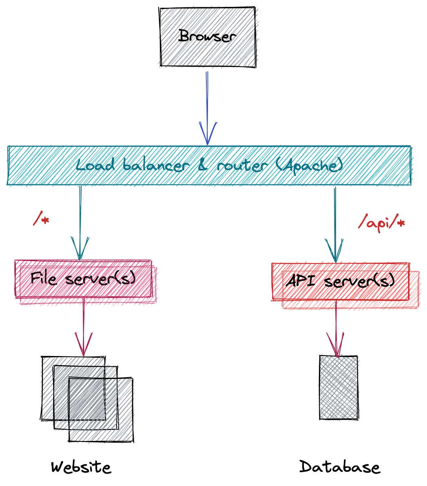

# Multiple servers

Create file server to serve static HTML files. Create an API server that serves JSON from a database. Run the API and file server as two separate servers. Try to load the website & see CORS issue. Put apache in front of the file server and the API so they are on a single port and hostname. Learn about how to run services in VMs in the cloud. Replicate this local setup in the cloud on a single VM, with all services running on the same host. Route requests to the service.

Timebox: 5 days

Learning objectives:

- Basic microservices ideas, separating concerns of services
- Configure apache to talk to 2-3 copies of the API server
- Some web security ideas (CORS)
- Reverse proxy configuration, routing on path
- Health checks

In future:

- Running applications in the cloud
- Using a cloud-hosted databases
- Multi-environment configuration

## Project

### Design

In this project, we'll build something with the following architecture.



We'll make the file and API server, and use open source software called [nginx](https://nginx.org/) as the load balancer and router.

You can follow the arrows to visualise the path the _request_ takes: an arrow from one box to another is getting data. The _response_ path is the arrow reversed.

You will find the words "upstream" and "downstream" used too. Unfortunately this can be confusing because it depends if you are thinking about the request or response path. In general, upstream and downstream are thought of in terms of dependencies, or from the view of a response. So, the file and API servers are "upstream" of the load balancer: data _flows down the stream_ from the file server to the load balancer, and then the browser.

Let's follow an example request, to `http://localhost:8080/index.html`:

1. The browser requests `http://localhost:8080/index.html`
1. The load balancer is listening on this port and receives the HTTP request
1. It looks at the path (`/index.html`) of the request and tried to match it against its configuration
1. The request path does not match `/api/*`, which you can read as "slash api slash anything". The `*` is often called a "wildcard".
1. The request _does_ match `/*` — "slash anything" — so it **routes** the request to the file server

This selection of where to send the request is called routing, and the order we perform the checks matters. `/*` matches everything, so if we checked that first, we'd never send any traffic to our API server. We check in order from the _most specific_ path pattern to the least specific path patterns.

### Module & packages

Our file layout for this project will look like this:

```console
api/
    api.go
assets/
    ... website ...
cmd/
    static-server/
        main.go
    api-server/
        main.go
config/
    nginx.conf
static/
    static.go
go.mod
```

This is because we're building _two_ servers in the same module: `api` and `static`. Each has its own code and functionality.

Each will be similar, but slightly different because one is connecting to a database and the other is serving files.

There will also be command line tools for configuring and starting each server, in the `cmd` directory:

- `go run ./cmd/api-server` — start the API server
- `go run ./cmd/static-server` — start the static server

Specifically, the `cmd/` files will import functionality from `api` and `static` respectively, and run them. This modularity will make the code easier to understand (which is _the most important thing_ for code!). If you need a refesher on modularity in Go, the Go website has [a good guide](https://go.dev/doc/code).

In reality, starting each will look like this:

```console
# api server
$ DATABASE_URL='postgres://localhost:5432/go-server-database' go run ./cmd/api-server --port 8081

# static server
$ go run ./cmd/static-server --path assets --port 8082
```

### Static server

Our "static" server will serve the files for a really simple website. The website will fetch images from our API server and display them as an image gallery.

If you have time or simply want to, you can build this website yourself! However, to get us started, here is something that will work.

Below are three files:

- `index.html` — the main page of the website
- `style.css` — stylesheet for the image gallery
- `script.js` — JavaScript that fetches the image from the API and adds them to the page

Put each of these files into a directory called `assets`: we'll tell the static server to serve these files later on.

##### `index.html`

```html
<!DOCTYPE html>
<html lang="en">
  <head>
    <meta charset="utf-8" />
    <meta name="viewport" content="width=device-width, initial-scale=1" />
    <title>Image gallery</title>
    <link rel="stylesheet" href="style.css" />
    <script src="script.js" defer></script>
  </head>
  <body>
    <div class="wrapper">
      <div class="content" role="main">
        <h1 class="title">Gallery</h1>
        <h2>Sunsets and animals like you've never seen them before.</h2>
        <div class="gallery">Loading images&hellip;</div>
      </div>
    </div>
  </body>
</html>
```

##### `style.css`

```css
:root {
  --color-bg: #565264;
  --color-main: #ffffff;
  --color-primary: #d6cfcb;
  --color-secondary: #ccb7ae;
  --color-tertiary: #706677;
  --wrapper-height: 87vh;
  --image-max-width: 300px;
  --image-margin: 3rem;
  --font-family: "HK Grotesk";
  --font-family-header: "HK Grotesk";
}

/* Basic page style resets */
* {
  box-sizing: border-box;
}
[hidden] {
  display: none !important;
}

img {
  max-width: 100%;
}

/* Import fonts */
@font-face {
  font-family: HK Grotesk;
  src: url("https://cdn.glitch.me/605e2a51-d45f-4d87-a285-9410ad350515%2FHKGrotesk-Regular.otf?v=1603136326027")
    format("opentype");
}
@font-face {
  font-family: HK Grotesk;
  font-weight: bold;
  src: url("https://cdn.glitch.me/605e2a51-d45f-4d87-a285-9410ad350515%2FHKGrotesk-Bold.otf?v=1603136323437")
    format("opentype");
}

body {
  font-family: HK Grotesk;
  background-color: var(--color-bg);
  color: var(--color-main);
}

/* Page structure */
.wrapper {
  min-height: var(--wrapper-height);
  display: grid;
  place-items: normal center;
  margin: 0 1rem;
}
.content {
  max-width: 1032px;
  width: 100%;
  display: flex;
  flex-direction: column;
  align-items: start;
  justify-content: start;
}

h1 {
  color: var(--color-primary);
  font-style: normal;
  font-weight: bold;
  font-size: 100px;
  line-height: 105%;
  margin: 0;
}

h2 {
  color: var(--color-secondary);
}

.gallery-image img {
  border: 1em solid var(--color-tertiary);
}
```

##### `script.js`

```javascript
function fetchImages(development) {
  if (development) {
    return Promise.resolve([
      {
        Title: "Sunset",
        AltText: "Clouds at sunset",
        URL: "https://images.unsplash.com/photo-1506815444479-bfdb1e96c566?ixlib=rb-1.2.1&ixid=MnwxMjA3fDB8MHxwaG90by1wYWdlfHx8fGVufDB8fHx8&auto=format&fit=crop&w=1000&q=80",
      },
      {
        Title: "Mountain",
        AltText: "A mountain at sunset",
        URL: "https://images.unsplash.com/photo-1540979388789-6cee28a1cdc9?ixlib=rb-1.2.1&ixid=MnwxMjA3fDB8MHxwaG90by1wYWdlfHx8fGVufDB8fHx8&auto=format&fit=crop&w=1000&q=80",
      },
    ]);
  }
  return fetch("http://localhost:8080/api/images.json").then((_) => _.json());
}

function timeout(t, v) {
  return new Promise((res) => {
    setTimeout(() => res(v), t);
  });
}

const gallery$ = document.querySelector(".gallery");

fetchImages(true).then(
  (images) => {
    gallery$.textContent = images.length ? "" : "No images available.";

    images.forEach((img) => {
      const imgElem$ = document.createElement("img");
      imgElem$.src = img.URL;
      imgElem$.alt = img.AltText;
      const titleElem$ = document.createElement("h3");
      titleElem$.textContent = img.Title;
      const wrapperElem$ = document.createElement("div");
      wrapperElem$.classList.add("gallery-image");
      wrapperElem$.appendChild(titleElem$);
      wrapperElem$.appendChild(imgElem$);
      gallery$.appendChild(wrapperElem$);
    });
  },
  () => {
    gallery$.textContent = "Something went wrong.";
  }
);
```

This code isn't meant to be fancy or be the focus of this exercise. Feel free to improve it (but don't get too distracted doing so)!

#### Static CLI tool

On to some Go!

We need a `main.go` file in `cmd/static-server/` that calls a `Run` function in `static/`. The `Run` function should, for now, just call `log.Println("Hello!")`.

To do this, we need the `main.go` to know where to find the code. Luckily Go brings all this together in an easy way...

First, our `go.mod` file needs to declare a module name. Let's go with `servers`.

```go
module servers
```

Now, we can start a file in `static/` — let's say `static/static.go` — like this:

```
package static

func Run() {
    // ...
}
```

With this in place, other code in your module can import `servers/static` and use `Run`:

```
package main

import (
    "servers/static"
)
```

The rest is up to you: hook this together and make this work:

```console
$ go run ./cmd/static-server
Hello!
```

Next, we need the CLI tool to know where to look for files.

To do that, add support for a command like flag: `--path` which will be where the static files are read from. We can use the [flag](https://pkg.go.dev/flag) package for this.

Make this work:

```console
$ go run ./cmd/static-server --path assets
path: assets
```

We also want this server to run on a specific port. Make this work:

```console
$ go run ./cmd/static-server --path assets --port 8082
path: assets
port: 8082
```

Remember that it should be `static/static.go` that is doing the printing, not `cmd/static-server/main.go`! The configuration should be passed from one to the other.

### Static server

Now we've got config being passed forward, we can build the server itself. This will be up to you to figure out!

This is not as complicated as it might sound. Have a look at all the functions in Go's `net/http` package: there's some useful stuff in there. And make sure to read the [`Handle` documentation](https://pkg.go.dev/net/http#ServeMux.Handle) to see how the `net/http` does URL path matching.

It's possible to do this all in <20 lines of code.

At the end, you should be able to run the server and visit [http://localhost:8082] to see the image gallery!

```console
$ go run ./cmd/static-server --path assets --port 8082
```

We aren't loading the list of images from an API yet; they're hard coded in the JavaScript. Making the API work is coming next.
