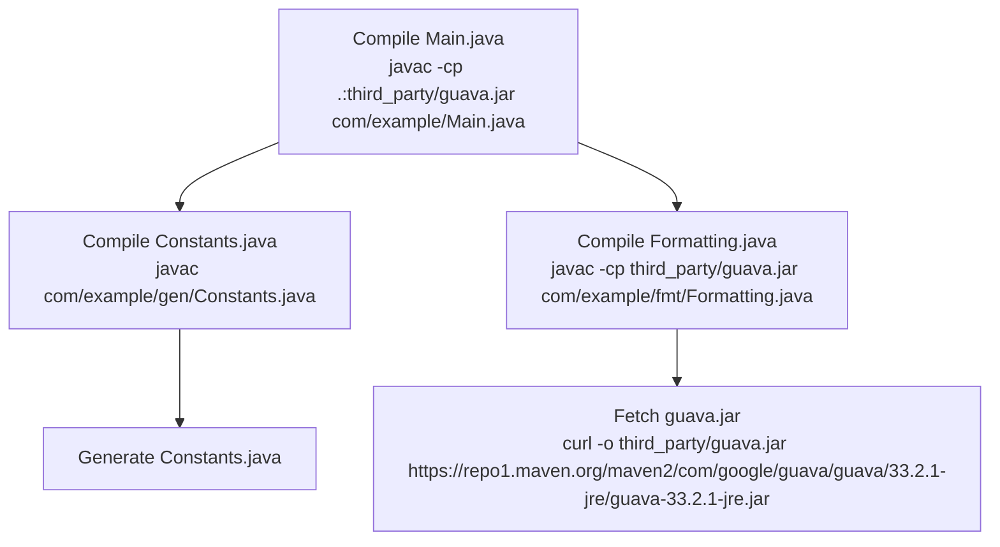
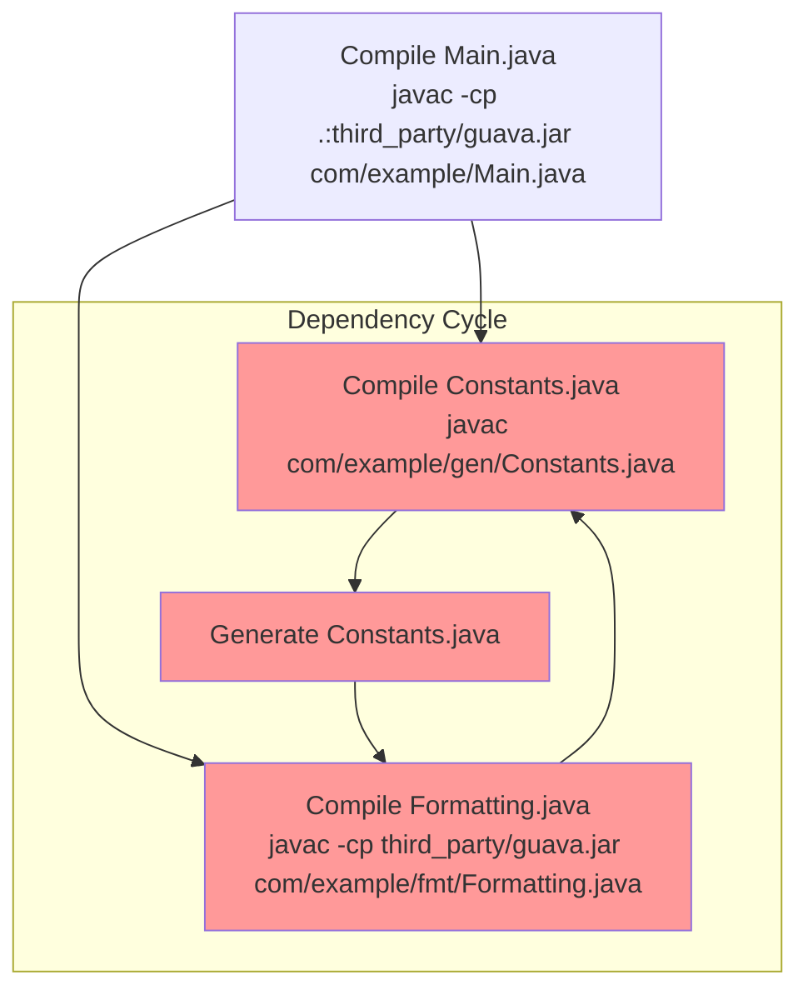
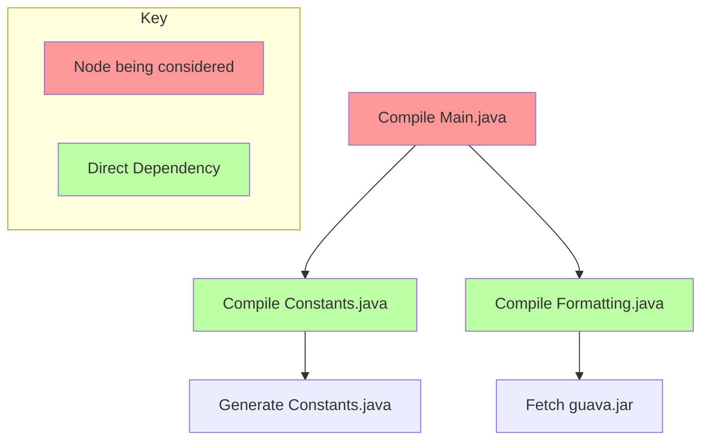
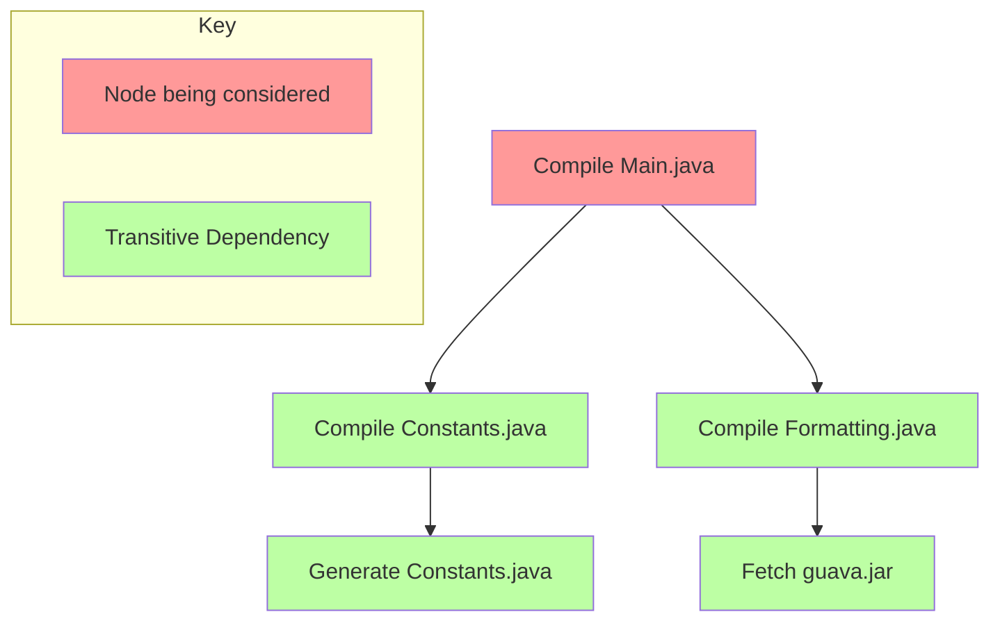
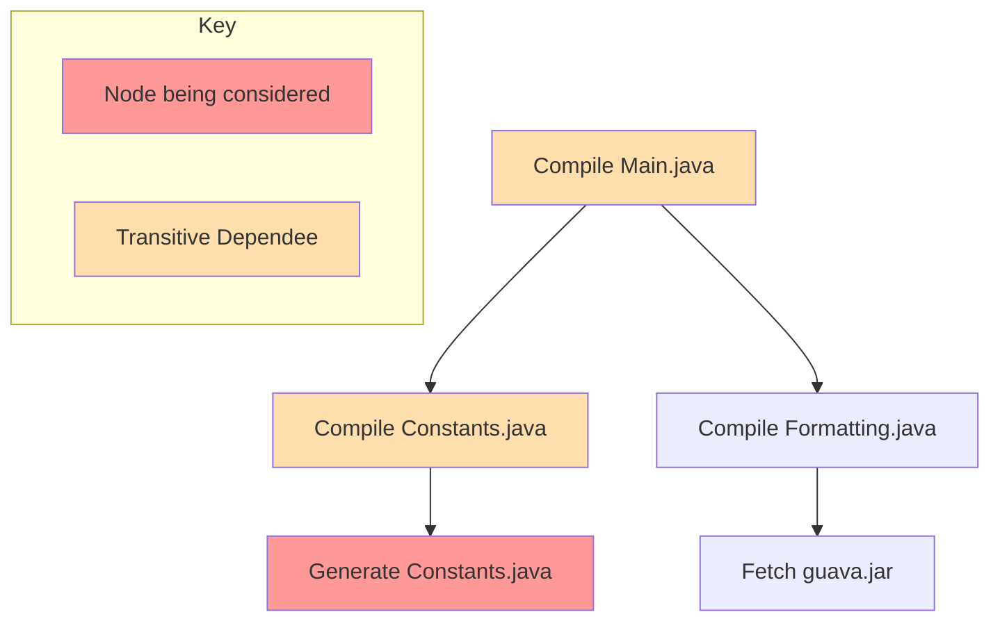
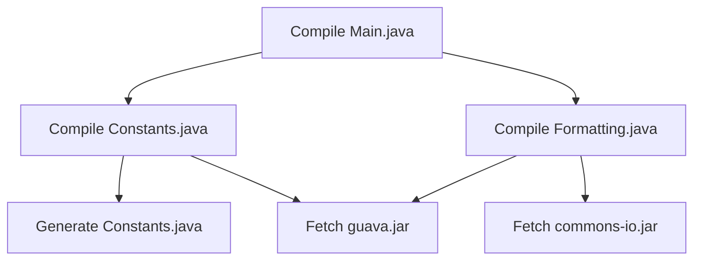
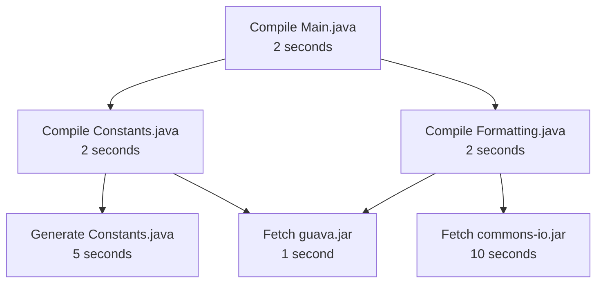
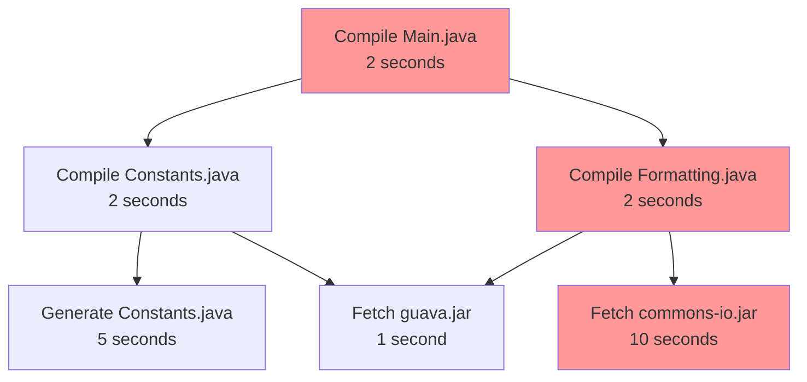
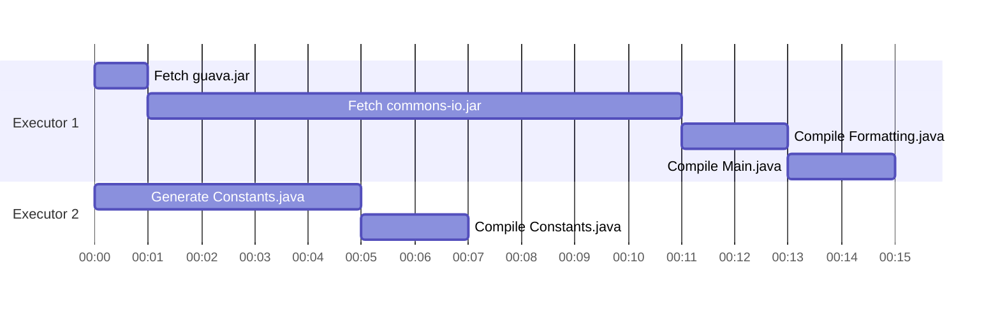
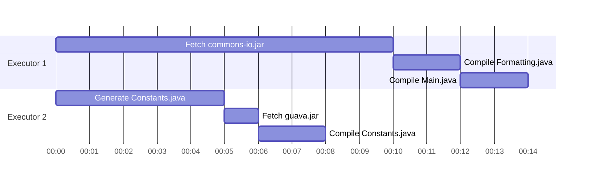

+++
title="3. Build graphs"
+++

# 3. Build graphs

A useful way to visualise the relationships and ordering constraints between different build actions is a graph.

A graph is a diagram which is made up of nodes, and edges between those nodes. When constructing graphs for build systems, typically the nodes are build actions (and the output they produce), and the edges between them denote dependency relationships, for example:

### Directed Acyclic Graphs (DAGs)

Notice that the edges have arrows - they are **directed**. We say can say that "Compile Constants.java" _depends on_ "Generate Constants.java" - it's not possible for us to compile Constants.java until we've generated it. We call a graph where all of the edges have a direction a **directed graph**. In build systems, we only work with directed graphs.

Some people draw build graphs with the arrows in the other direction (to say "Generate Constants.java _is depended on by_ Compile Constants.java"). It doesn't matter which way you draw the arrows as long as you're consistent and clear.

We never want there to be cycles in our build graph. Consider this example:

This graph has a dependency cycle. In order to generate Constants.java we need to have compiled Formatting.java. But in order to compile Formatting.java we need to have compiled Constants.java. But in order to compile Constants.java, we need to have already compiled Formatting.java. There's no order we can perform these tasks - we can't do any one of them without having already done another of them. Build graphs should never contain cycles - they should be **acyclic**.

We talk about build graphs as being **Directed Acyclic Graphs** (or "**DAGs**" for short).

Other areas of computer science also use graphs, and graph theory is an entire field of study. In this primer we will only focus on DAGs as they apply to build systems.

### Terminology: Dependencies and Dependees, Direct and Transitive

When a build action depends on the output of some other build action before it can run, we say this is a dependency relationship.

Compile Constants.java and Compile Formatting.java are direct dependencies of Main.java:

A **transitive dependency** is something which is either your dependency, or a dependency of one of your dependencies, or a dependency of one of their dependencies, or so on. This means that _both_ Compile Constants.java _and_ Generate Constants.java are _transitive_ dependencies of Compile Main.java:

Similarly, Compile Constants.java and Compile Main.java are both **transitive dependees** of Generate Constants.java:

**Note**: A direct dependency/dependee is always _also_ a transitive dependency/dependee, but sometimes in discussion "direct" and "transitive" are used in contrast with each other.

### Order of execution

If we're trying to perform a build, what order do we need to complete the build actions?

The only hard constraint is that for every dependency/dependee pair, the dependency must be completed before the dependee can be started.

In this build graph:

Imagine we can only run one action at a time. These are valid orderings:
* Generate Constants.java - Fetch guava.jar - Fetch commons-io.jar - Compile Constants.java - Compile Formatting.java - Compile Main.java
* Generate Constants.java - Fetch commons-io.jar - Fetch guava.jar - Compile Constants.java - Compile Formatting.java - Compile Main.java
* Fetch guava.jar - Generate Constants.java - Fetch commons-io.jar - Compile Constants.java - Compile Formatting.java - Compile Main.java
* Fetch guava.jar - Fetch commons-io.jar - Generate Constants.java - Compile Constants.java - Compile Formatting.java - Compile Main.java
* Fetch commons-io.jar - Generate Constants.java - Fetch guava.jar - Compile Constants.java - Compile Formatting.java - Compile Main.java
* Fetch commons-io.jar - Fetch guava.jar - Generate Constants.java - Compile Constants.java - Compile Formatting.java - Compile Main.java
* Generate Constants.java - Fetch guava.jar - Fetch commons-io.jar - Compile Formatting.java - Compile Constants.java - Compile Main.java
* Generate Constants.java - Fetch commons-io.jar - Fetch guava.jar - Compile Formatting.java - Compile Constants.java - Compile Main.java
* Fetch guava.jar - Generate Constants.java - Fetch commons-io.jar - Compile Formatting.java - Compile Constants.java - Compile Main.java
* Fetch guava.jar - Fetch commons-io.jar - Generate Constants.java - Compile Formatting.java - Compile Constants.java - Compile Main.java
* Fetch commons-io.jar - Generate Constants.java - Fetch guava.jar - Compile Formatting.java - Compile Constants.java - Compile Main.java
* Fetch commons-io.jar - Fetch guava.jar - Generate Constants.java - Compile Formatting.java - Compile Constants.java - Compile Main.java

There is no dependency relationship between Generate Constants.java, Fetch guava.jar, and Fetch commons-io.jar, so they can go in any order relative to each other.

And there is no dependency relationship between Compile Constants.java and Compile Formatting.java, so they can go in either order relative to each other.

But every other node has dependency relationships constraining when they can be run when. e.g. Compile Main.java definitely needs to be last.

This is a kind of sorting called **topological sorting**.


Write a function in the language of your choice which will generate _one_ valid ordering of a dependency graph. (You do not need to generate _all_ of them).

To do this, you will need to think about how to represent a dependency graph in your code. One example is to accept an array of dependee-dependency pairs representing edges. Another is to accept a map where the keys are nodes and the values are a list of nodes. Yet another is to use a library to represent graphs. All of these can work.

Test your implementation with the above dependency graph.


### The critical path

Imagine these actions take these durations to run:

If we can only run one action at a time, the build will always take the sum of the times of all of the individual actions, because we need to run them all: 22 seconds.

Imagine we can run as many actions at once as we need. What's the fastest we could run the whole build?

We're limited by the single slowest path from the top to the bottom of the graph. Let's consider all of the paths:

* Compile Main.java - Compile Constants.java - Generate Constants.java: 9 seconds.
* Compile Main.java - Compile Constants.java - Fetch guava.jar: 5 seconds.
* Compile Main.java - Compile Formatting.java - Fetch guava.jar: 5 seconds.
* Compile Main.java - Compile Formatting.java - Fetch commons-io.jar: 14 seconds.

The slowest chain here is the last one - 14 seconds:

This means that there is no way we can run this build in less than 14 seconds, even if we can run lots of things at once.

We call this path through the graph **the critical path**.


Write a function in the language of your choice which will output a critical path for a given graph containing the execution times of each node.

You can decide how it should behave if more than one path exist with the same time.

Test your implementation with the above dependency graph and its execution times.


### Limited parallelism

Let's imagine we can only run two actions at a time. When we have a free slot to run something, we can pick any node where all of its dependencies have already been run. How would that affect the time it takes to run our build? That depends on which order we choose to run things.

Imagine we started running Generate Constants.java and Fetch guava.jar - our build will take 15 seconds:

After 1 second, we'll be done with Fetch guava.jar, and can start fetching commons-io.jar. But we know that from the start of fetching commons-io.jar, our build can't take less than 14 seconds, because Fetch commons-io.jar is on the critical path.

Instead, if we'd started by fetching commons-io.jar, we could have completed the whole build in 14 seconds:

If we know up-front how long each action is going to take, we can choose an optimal ordering of the actions. If we don't know how long actions will take (which is generally the case), there are several [heuristics](https://en.wikipedia.org/wiki/Heuristic) we can use to pick an ordering. For example:
* Try to **estimate durations** - maybe we can guess how long things will take based on our knowledge of the actions - maybe we know that fetching from particular domains is slow, or we know that compiling a folder of 10 files is slower than compiling a folder of 1 file. Or maybe we can look at how long actions took to run in the past, and use that as an estimate for future run-times.
* Run things that **unlock more parallelism**. Two things directly depend on Fetch guava.jar, whereas only one thing directly depends on Generate Constants.java. If we had to pick which of the two to run, maybe Fetch guava.jar will allow us to run more things sooner.
* Consider resource **bottlenecks**. Fetching guava.jar and commons-io.jar both need to use the network. So if we're already fetching commons-io.jar, maybe we would prefer to run Generate Constants.java rather than Fetch guava.jar because the fetch actions will contend for the same resources (network) which may have a limit.

