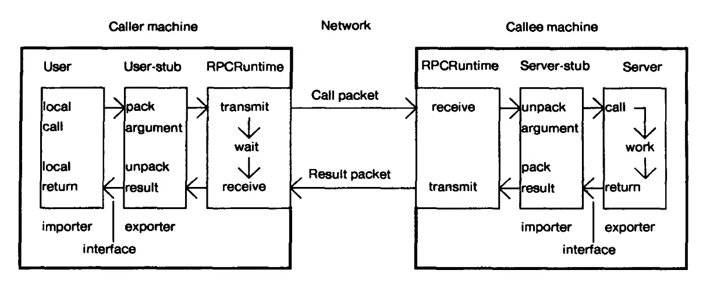

<!--forhugo
+++
title="1. Reliable RPCs"   
+++
forhugo-->

# 1

## Reliable RPCs {#section-1-reliable-rpcs}

### About Remote Procedure Calls (RPCs) {#about-remote-procedure-calls-rpcs}

The Remote Procedure Call is the fundamental building block of distributed systems: they are how you can run a procedure - i.e. a piece of code - on another machine. Without RPCs we cannot build an efficient distributed system: they are essential to the existence of GMail, Netflix, Spotify, Facebook, and all other large-scale distributed software systems. Keeping RPCs flowing reliably is a significant part of most infrastructure engineering jobs.

RPCs aren’t the same as [HTTP requests](https://developer.mozilla.org/en-US/docs/Web/HTTP/Overview). HTTP is a text-based protocol, oriented towards resources or entities. RPCs are oriented towards calling a specific function. RPCs are highly structured; normally the request and response are encoded in efficient binary formats which are not human-readable. However these structured formats can be used to transmit data between computers using much less bandwidth than JSON or other text formats. Structured RPCs are also more efficient to parse than text, meaning that CPU usage will be lower. It depends on the logic of the specific application, but parsing of requests and encoding of responses often uses a very significant percentage of the computing resources needed by a web service.

HTTP APIs are usually limited to CRUD (Create, Read, Update, Delete) operations; RPCs can perform any kind of operation. If you want to efficiently integrate two systems that you control, RPCs are a good choice. If you want to provide an API for use by developers outside of your organisation then HTTP APIs are generally a better choice, because they are simpler to develop against and all programming languages provide good HTTP support.

This diagram is from [Nelson and Birell’s classic paper](http://birrell.org/andrew/papers/ImplementingRPC.pdf) on implementing RPCs. Both client and server use _stubs_ to define the structure of the request and the response.

There is also an RPCRuntime library, which takes care of the mechanics of locating the server machine, transmitting the request, and waiting for the response.

Today, two of the most popular RPC frameworks are [Thrift](https://thrift.apache.org/) and gRPC. Thrift was developed at Meta (Facebook) and is popular in the Java ecosystem. gRPC was developed at Google and supports a variety of languages, but is most associated with the Go programming language.

The [gRPC quickstart guide for Go](https://grpc.io/docs/languages/go/quickstart/) explains how to define a simple gRPC service definition (this is the API that your program serves), compile it - which generates the user stubs and service stubs shown in the diagram above - and use it in your program.

### RPCs: What Could Go Wrong? {#rpcs-what-could-go-wrong}

The idea of RPCs is not complicated. The real challenge of distributed systems is dealing with the problems that unreliable networks create. Since the 1990s programmers have talked about the [Eight Fallacies of Distributed Computing](https://web.archive.org/web/20171107014323/http://blog.fogcreek.com/eight-fallacies-of-distributed-computing-tech-talk/) - in other words, things that most programmers wrongly assume are true.

## The most important fallacies are:

> 1. [The network is reliable](#fallacy-1-the-network-is-reliable)
> 2. [Latency is zero](#fallacy-2-latency-is-zero)
> 3. [Bandwidth is infinite](#fallacy-3-bandwidth-is-infinite)
> 4. [The network is secure](#fallacy-4-the-network-is-secure)

### Fallacy 1: The network is reliable {#fallacy-1-the-network-is-reliable}

> All networks that really exist, that are configured and accessed by human beings, served from machines sitting in a building, connected by cables and powered by electricity, are unreliable, because any of these things can break. In reality, your network is not reliable.

#### Unreliable networks, errors, and retries {#unreliable-networks-errors-and-retries}

Sometimes communication from a client will fail to reach the server, or the server’s response will fail to return to the client, even though the work requested was completed.

RPCs can fail for other reasons. Sometimes servers will reject requests because they are overloaded and do not have the capacity to serve additional requests.

Graceful shutdowns of servers can cause client errors. All servers have a lifecycle: they are launched, they begin serving, and at some point, they will stop serving and be replaced. In a distributed system, we usually have multiple servers - so we can gracefully replace servers by sending requests elsewhere. Servers that are about to shut down can send error codes to clients attempting to begin new requests (the HTTP/2 [GOAWAY ](https://httpwg.org/specs/rfc7540.html#GOAWAY)code is an example of this). The client is expected to try another available server.

All client-server code needs to deal with errors. A common method is to _retry_ a request that failed, by re-sending it to a different server. Retries are a useful strategy but there are pitfalls. These considerations can be grouped under: Status codes, Idempotency, and Limits.

##### Status codes {#status-codes}

The first question to ask when retrying a request is whether it is a request that could possibly succeed. Errors returned by the gRPC library to a client include a [status code](https://grpc.github.io/grpc/core/md_doc_statuscodes.html) - these are somewhat similar to HTTP status codes. The status code can be generated either by the server or by the client (for example, if the client can’t connect to the server the client will generate an `UNAVAILABLE` status code and return it to the calling code). Some of these codes indicate that a request is never likely to succeed - for example,` INVALID_ARGUMENT` means that the request is malformed in some way - while others, like `UNAVAILABLE` or `RESOURCE_EXHAUSTED `might succeed if retried.

##### Idempotency {#idempotency}

The second question to ask is whether it is safe to retry the request or not. Some kinds of requests are[ idempotent](https://betterprogramming.pub/architecting-distributed-systems-the-importance-of-idempotence-138722a6b88e): this means that the result will be the same, whether you make the request once or multiple times. For example, setting an attribute to a specific value is idempotent, but adding a number to the existing value is not. Non-idempotent requests can’t be safely retried. This means that it’s best to design your systems with idempotent APIs wherever possible. Services can use unique request IDs to deduplicate requests, changing a non-idempotent API into one that may be safely retried.

##### Limits {#limits}

It is very important to limit the number of retries that a client makes to a service. If a service becomes overwhelmed with load and each of its clients repeatedly retries failing requests then it becomes a vicious cycle. The service will not be able to recover without intervention. Groups of continuously-retrying clients can create an effect similar to a [Distributed Denial of Service](https://www.cloudflare.com/en-gb/learning/ddos/what-is-a-ddos-attack/) (DDoS) attack.

A maximum of three retries is a reasonable rule of thumb for interactive workloads, in other words, when a human is waiting for a response. By the time your system has retried three times the user is likely to try again or to give up, so there is no point in making further attempts. However, some systems are not interactive, such as [batch jobs](https://en.wikipedia.org/wiki/Batch_processing) or [data pipelines](https://www.snowflake.com/guides/data-pipeline). In these systems it is reasonable to attempt more than three retries, after a long delay.

There are lots of ways to limit retries: by layer, by duration between attempts, and with circuit breakers.

##### Layers {#layers}

Systems may implement retrying at multiple levels. For example, it is not uncommon to see client retries combined with retries at a loadbalancing layer. This has a multiplicative effect: if both levels retry failed requests three times, then this can result in nine retries. It is best to limit the use of retries to one layer of your stack and to be consistent about where they are performed.

##### Duration Between Attempts {#duration-between-attempts}

Clients should increase the duration of their waits between retries exponentially: double it for the second retry attempt, again for the third, and so on. This technique is called _exponential backoff_. In cases where a backend service is briefly unavailable, the use of exponential backoff by its clients means that the backend service is less likely to be overwhelmed with load when it comes back up.

Jitter means a short variable wait before retrying. It is good practice to use jitter when retrying. The jitter, or wait time, is randomly chosen, between a minimum and maximum value. The idea of introducing such jitter is to avoid overwhelming backend servers with a coordinated ‘echo’ of an original spike of errors, which could cause a further overload.

Use jitter and exponential backoff together r when implementing retries. Many programming languages include libraries that implement exponential backoff with jitter - for example, see [GoLang’s go-retry library](https://pkg.go.dev/gopkg.in/retry.v1). Some loadbalancers, such as [Envoy Proxy](https://www.envoyproxy.io/docs/envoy/latest/faq/load_balancing/transient_failures), also allow you to configure these retry strategies at the loadbalancer layer.

###### Circuit Breakers {#circuit-breakers}

A very useful pattern for client-server requests is the [Circuit Breaker](https://martinfowler.com/bliki/CircuitBreaker.html). Use circuit breakers to limit potentially-dangerous retries. According to Martin Fowler: “The basic idea behind the circuit breaker is very simple. You wrap a protected function call in a circuit breaker object, which monitors for failures. Once the failures reach a certain threshold, the circuit breaker trips, and all further calls to the circuit breaker return with an error, without the protected call being made at all. Usually you'll also want some kind of monitor alert if the circuit breaker trips.”

### Fallacy 2: Latency is zero {#fallacy-2-latency-is-zero}

> All real networks are connected over real physical distances. The distance between nodes is like the travel time between cities on Google Maps: the route, mode of transport, amount of traffic, and distance, all affect the travel time. Latency means the time taken for a request to traverse the network. Network latency is travel time.

#### Variable latency and deadlines {#variable-latency-and-deadlines}

Latency can be highly variable, particularly over long distances. Processing time at the server can also vary a lot, which matters because latency as perceived by clients is the sum of network latency and application processing time at the server.

High latency has implications for clients. It is always a bad idea to wait indefinitely for a response from a server. It is entirely possible to end up waiting forever. For example, if the server ‘hangs up’ and your TCP connection does not have keepalives enabled, you will wait indefinitely. When this happens, no useful work gets done and it can result in problems that are difficult to track down, because a client that waits indefinitely generates no errors.

If some abnormal condition means that many clients in a system are experiencing long waits for some service (even a small and trivial one) it can result in widespread problems as everything slows down waiting for the slowest service. Again, this is generally difficult to troubleshoot. When everything is slow, the source of that slowness is not obvious - it can be quite hard to pinpoint the reason.

Instead, define a specific deadline for every RPC request and deal with it as an error when the deadline is past. This is a much better approach because it is usually very easy to find errors in monitoring and in logs. When our systems are not operating correctly, it is very important to be able to quickly find the problem and solve it.

Set deadlines much higher than typical response latencies. In general, the deadline should be higher than your typical 99.9% response time - this means that only one in 1000 requests would be slower than the deadline in normal operation.

You should be able to find out what your observed response latencies are either by using your monitoring system or by analysing application logs. Your organisation may run an open-source monitoring tool such as [Prometheus ](https://prometheus.io/)or [Graphite](https://grafana.com/oss/graphite/), or you may use a SaaS monitoring system such as [New Relic](https://newrelic.com/) or [DataDog](https://www.datadoghq.com/). All of these systems allow you to [instrument your application](https://alex.dzyoba.com/blog/go-prometheus-service/) so that you can understand runtime behaviour, such as response latencies and error rates.

It is very important to monitor your observed error rates and latencies and to investigate if you see a significant number of timeouts. The threshold you set here depends on the degree of reliability required for your application, but a typical threshold for a high-traffic application would be more than 0.01% of requests timing out, or failing for any reason.

You should also monitor whether your observed request latencies are approaching the deadline you have set. For example, you might configure your monitoring system to alert if the 99th [percentile](https://en.wikipedia.org/wiki/Percentile) latency (i.e. the slowest 1% of requests) exceeds 80% of your configured request deadline. The reason for this is that request latencies may drift higher as changes are made to systems over time. If request latencies become so slow that many requests begin to take longer than the deadline, then your system is doing wasted work. Clients will retry failed requests, and your system may become overloaded as a result. AWS’s account of their [DynamoDB Service Disruption](https://aws.amazon.com/message/5467D2/) in 2015 is a good description of this phenomenon.

### Fallacy 3: Bandwidth is infinite {#fallacy-3-bandwidth-is-infinite}

> All systems that actually exist in the world have limits. Computers do not have infinite memory. Networks do not have infinite bandwidth. All the nodes in your system are physically real and all real things are finite, or limited.

#### Limited bandwidth {#limited-bandwidth}

Network bandwidth is not unlimited. Passing very large requests or responses between machines may be unreliable. As we saw above, it is helpful to set deadlines on requests. However, it is possible that the time to process a very large request might exceed an RPC deadline. Some services also attempt to buffer incoming requests before beginning to process them. Because no computer has infinite memory, it is common (and good practice) to limit the size of buffered requests. However, very large requests may exceed the configured buffer size and fail. In most cases, very large requests bodies are not legitimate requests. Where large amounts of data must be transferred, it is worth considering a specialised protocol (such as [tus, which has a Go implementation](https://pkg.go.dev/github.com/tus/tusd?utm_source=godoc)).

### Fallacy 4: The network is secure {#fallacy-4-the-network-is-secure}

> Your network exists in the world and interacts with other networks, systems, and actors, with their own objectives. Many of these objectives conflict with your own, and some are hostile. Networks can never be assumed to be secure.

#### mTLS

You should assume that all network links are being eavesdropped, and therefore by default encrypt all data on the wire. This is modern best practice. Applications should use methods such as [mTLS ](https://www.cloudflare.com/en-gb/learning/access-management/what-is-mutual-tls/)to secure communications between clients and servers.

Here’s how you do [mTLS in Go](https://venilnoronha.io/a-step-by-step-guide-to-mtls-in-go), although in a real production environment you also need to manage the creation, distribution and renewal of keys. Here’s how [Zendesk does mTLS key management](https://zendesk.engineering/implementing-mtls-and-securing-apache-kafka-at-zendesk-10f309db208d).

---

## Questions {#questions}

- ​​What is latency? Why is it important?
- Why is idempotency a desirable property in a web service?
- When should I use RPCs, as opposed to simple HTTP requests?

## Project work for this section {#project-work-for-this-section}

See:

- [https://github.com/CodeYourFuture/immersive-go-course/tree/main/http-auth](https://github.com/CodeYourFuture/immersive-go-course/tree/main/http-auth) [should have been done in prework]
- [https://github.com/CodeYourFuture/immersive-go-course/tree/main/grpc-client-server](https://github.com/CodeYourFuture/immersive-go-course/tree/main/grpc-client-server)
