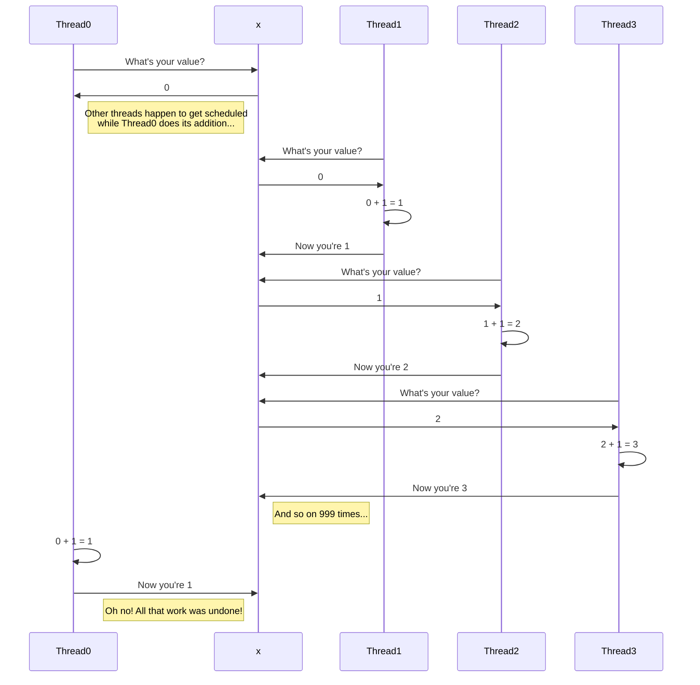

<!--forhugo
+++
title="Concurrency"
+++
forhugo-->

In this project you're going to learn about how to safely use multiple threads. You will learn about concurrency, thread safety, and synchronisation.

Timebox: 3 days

## Learning Objectives:

- Suggest orders of magnitude for the speed of different read operations
- Explain why web applications are concurrent by default
- Define the term "memory barrier"/"fence" in the context of memory models
- Explain when and why synchronisation is needed
- Choose appropriate synchronisation primitives for specific problems from atomics, wait-groups, mutexes/locks, read-write locks, and channels
- Identify the critical section across multiple statements

## Background

### Threads and concurrency

Normally when we run a program, it runs one instruction at a time. It starts at the start of a `main` function and goes top-to-bottom (sometimes jumping into functions, and back out of them).

There are limits to how fast any one instruction can be run. Processors have stopped getting faster. Instead, we now add more processors to a computer. This allows a computer to do more than one thing at a time. But it's much harder to tell a computer in what order things need to happen, or what things must/mustn't happen at the same time.

Most practical projects, and almost all servers, use concurrency - running more than one thing at a time - to improve their performance. They start multiple threads which can independently perform work.

But this concurrency doesn't come for free. It's really easy to write incorrect concurrent code, and this often results in serious (and hard to debug!) bugs, or bottlenecks which fall back to single-threaded performance.

### Memory models

As you will have learnt in Chapter 7 of [How Computers Really Work](https://www.howcomputersreallywork.com/), some memory is cheap but slow, and other memory is fast but expensive. CPU manufacturers add fast per-core caches in front of cheap system-wide memory. This causes problems when multiple cores try to share the same item in memory. Each core's cache may get its own copy of that memory, and if one core changes the contents of that data, the other core won't see that change.

You can see estimated speeds of different memory (and other) read operations in ["Latency Numbers Every Programmer Should Know"](https://gist.github.com/jboner/2841832). Read this and make sure you undersatnd it. This suggests that reading from shared main memory is 100-1000x slower than reading from a per-core L1 cache.

This set of projects will introduce different ways we can handle this problem.

Read [the concurrency section](https://golangbot.com/learn-golang-series/#concurrency) of [golangbot.com](https://golangbot.com/) (i.e. chapters 20-25). Run the examples and make sure you understand their output.

## Projects

### Single-variable concurrency

Let's look at the example buggy code from the Mutexes chapter of golangbot:

```go
package main

import (
	"fmt"
	"sync"
)

var x = 0

func increment(wg *sync.WaitGroup) {
	x = x + 1
	wg.Done()
}

func main() {
	var w sync.WaitGroup
	for i := 0; i < 1000; i++ {
		w.Add(1)
		go increment(&w)
	}
	w.Wait()
	fmt.Println("final value of x", x)
}
```

In an ideal world, this program would always output 1000.

Extract the `main` function into a new function, and change `main` to call that function 5 times. Observe the results - the runs show different numbers.

The root cause is that multiple threads are handling the variable `x`, and nothing is making sure they don't get in each other's way.

The statement `x = x + 1` does three operations:
1. Look up the value at the memory location of `x`
2. Compute `(that looked-up value) + 1`
3. Assign `(that computed value)` to the memory location of `x`

A problem here is that other operations from other threads may happen between these operations.

Two threads may both read `0` from step 1, compute `1` from step 2, and try to write `1` in step 2 (they did the same work).

Or one thread may read `0`, all other 999 threads may do their work as we hope (incrementing `x` one at a time in turn to `999`), then the first thread may do its step 3 and write `1` back to `x`, undoing the work of the other threads.



There are three families of solutions to this problem:
1. We can make sure no other thread is allowed to start doing these operations until one thread has completed all three. golangbot showed you how to do this with a `Mutex`.
2. We can make sure all the operations actually happen from one goroutine. golangbot showed you how to do this with a `channel`.
3. We can ask the CPU to do one operation which will achieve all three effects without allowing any gaps between them. golangbot hasn't shown you this yet. Let's explore it now.

#### Atomics

The problem we've identified is that we may end up using a stale version of the `x` variable. After we look it up, it may change before we write back our new value.

Atomic operations allow us to avoid this situation.

"Atomic" means "as one unit which can't be broken down". An atomic operation can't be broken down into smaller operations.

Go exposes atomic operations in [the sync/atomic package](https://pkg.go.dev/sync/atomic). [The `sync/atomic.Int32` type](https://pkg.go.dev/sync/atomic#Int32) exposes [an `Add` function](https://pkg.go.dev/sync/atomic#Int32.Add) which does the same as `+=` does to `int`, but looks a little different. Let's compare:

```go
var x int
x += 1
```

```go
var x atomic.Int32
newX := x.Add(1)
```

Both of these do the same thing. They start `x` with value `0`, they add one to it, and at the end `x` will have the value `1`.

The atomic version, though, does so as one operation. It's impossible for another thread to do something in the middle of the steps. The non-atomic version doesn't.

This means that if there are other threads involved, the atomic version will always store back to `x` exactly 1 more than its value at the time of execution. It also returns a value - the value that was stored back. It does this because if we're using atomics, we know there are probably other threads involved, so we _know_ we can't just read `x` and know what the result was - it may have been changed since we stored it.

Most atomic operations are implemented using [Compare And Swap ("CAS") operations](https://en.wikipedia.org/wiki/Compare-and-swap). In fact, a lot of other synchronisation primitives (e.g. Mutexes) are _also_ built on top of CAS operations.

Try to modify the buggy code above to use atomics. Make sure that if you run it a few times, you always end up with `1000`.

##### Memory barriers / fences

Under the covers, something involved in running our program (possibly the Go standard library, possibly something in the operating system, possibly even something in the CPU) is inserting something called [a memory barrier (also known as a fence)](https://en.wikipedia.org/wiki/Memory_barrier). This is an instruction to say "it's important that this operation is visible to other cores", which forces different cores to synchronise their views of a piece of memory before continuing.

This can be slow. Recall that we have these per-core caches because they're so much faster than sharing memory across cores. Every time we need to insert one of these memory barriers, we slow down our program. This is why memory access isn't all atomic by default. But it can be worth it.

#### When are atomics good/bad to use?

Atomics can be really useful when you need to operate on a single item of small data (e.g. a number). They are simple and easy to reason about. But they typically operate on one item in memory. If you need to operate on larger data (e.g. a string), multiple pieces of memory (e.g. two different numbers which must be changed together), or perform an operation not supported by atomics (e.g. multiplication), you probably can't use an atomic for that.

When using atomics, your threads are never blocked, and never need to wait for each other. Mutexes, on the other hand, block threads, which means that even though you may have started 100 threads to do work concurrently, only one will actually be doing anything (if they all need the same lock). This means that atomics can provide better throughput than other synchronisation primitives.

### Mutexes

[The golangbot Mutex section](https://golangbot.com/mutex/#mutex) used a `Mutex` instead of an atomic to solve the same problem. Mutexes are more flexible - you choose when you lock and unlock them, but more complicated - you need to make sure you unlock them at the right place. They are also prone to deadlock: Blocking your programme from making progress because two threads are waiting on locks held by each other.

If you have multiple operations which need to appear as if they were atomic (i.e. you must prevent other threads from taking action between the operations), a Mutex is often a good way to achieve this.

#### Critical Sections

When using a Mutex, it's crucial to work out where the Mutex needs to be acquired ("locked") and where it needs to be released ("unlocked").

In general, any time that some other thread changing something between operations would cause a problem, those operations need to be performed _under the same lock acquisition_.

Let's take an example of tracking some statistics. Imagine we have a counter for total number of requests, and counters for successful and failed requests. We may want the invariant to always hold: (successful requests + failed requests) = total requests.

This code would be buggy:

```go
type customerStats struct {
	failedReqs  int
	successReqs int
}

var (
	lock            sync.Mutex
	statsByCustomer = make(map[string]*customerStats)
)

func updateCustomerStats(customerId string, ok bool) {
	// Does customer stats object exist in map?
	lock.Lock()
	_, exists := statsByCustomer[customerId]
	lock.Unlock()

	// Create stats obj if necessary
	if !exists {
		lock.Lock()
		statsByCustomer[customerId] = &customerStats{}
		lock.Unlock()
	}

	lock.Lock()
	if ok {
		statsByCustomer[customerId].successReqs++
	} else {
		statsByCustomer[customerId].failedReqs++
	}
	lock.Unlock()
}
```

This is because we release the lock between two things we want to appear as atomic. In this code:

```go
go func() {
    updateCustomerStats("gina", true)
}()

go func() {
    updateCustomerStats("gina", false)
}()
```

both threads may do the "exists" check, see there's no stats for that customer, and create a new empty stats object. Both will write the new stats object into the map, and one of them will overwrite the other, discarding the other thread's data.

Instead we need to hold the lock across all of the operations that need to appear as atomic:

```go
    lock.Lock()
    // Does customer stats object exist in map?
    _, exists := statsByCustomer[customerId]

    // Create stats obj if necessary
    if !exists {
        statsByCustomer[customerId] = &customerStats{}
    }
    lock.Unlock()
```

We would _probably_ either include the `++` operation in the same lock, or use atomic operations for the increments. But the absolutely critical section that needs to be done under the same lock is the check for whether something is in the map, and writing a new value into the map if there isn't already one.

This is particularly important to consider when code is spread across functions. This code has a similar bug as above:

```go
type server struct {
    mu sync.Mutex
}

func (s *server) recordResult(isSuccess bool) {
    s.mu.Lock()
    defer s.mu.Unlock()
    if isSuccess {
        successfulRequests += 1
    } else {
        failedRequests += 1
    }
}

func (s *server) handleRequest() {
    s.mu.Lock()
    totalRequests += 1
    s.mu.Unlock()
    recordResult(true)
}
```

In the above case, the number of total requests isn't modified under the same lock as the success/failed requests. This means if some other code computed a success rate by dividing the number of successful requests by the total number of requests, it may show <100% success when 100% of requests were successful!

And this code would cause a deadlock, because one thread would be trying to acquire a lock it already holds:

```go
type server struct {
    mu sync.Mutex
}

func (s *server) recordResult(isSuccess bool) {
    s.mu.Lock()
    defer s.mu.Unlock()
    if isSuccess {
        successfulRequests += 1
    } else {
        failedRequests += 1
    }
}

func (s *server) handleRequest() {
    s.mu.Lock()
    defer s.mu.Unlock()
    totalRequests += 1
    recordResult(true)
}
```

One pattern that's often used is to have some functions require a lock is held in order to call them - something like:

```go
type server struct {
    mu sync.Mutex
}

// s.mu must be held to call this function.
// The compiler won't guarantee this is the case, but hopefully developers will see the name and the comment and do the right thing.
func (s *server) recordResult_locked(isSuccess bool) {
    if isSuccess {
        successfulRequests += 1
    } else {
        failedRequests += 1
    }
}

func (s *server) handleRequest() {
    s.mu.Lock()
    defer s.mu.Unlock()
    totalRequests += 1
    recordResult_locked(true)
}
```

### Project: LRU Cache with accurate statistics

You are going to implement a cache.

A cache is used to store some result (probably because it was in some way expensive to compute/fetch) so that it can be looked up more cheaply in the future.

Caches (like many problems) involves trade-offs. We are using some memory (by storing results) to save some other resource in the future (often compute time).

(Note that caches can get _very_ sophisticated - we're going to write quite a simple one).

Often times, when we use a cache, we want to limit how much memory it will use. This means we need to sometimes delete things from the cache. There are different policies for cache eviction. The one we are going to pick is "least recently used" (or LRU).

Imagine we have a limit of 3 items in our cache, and we already have three items in it. If we try to add an additional item, first, we need to remove one. We need to sort the entries by when they were most recently added or accessed, and remove the oldest.

We also want to keep statistics about our cache. We want to be able to ask the following questions:
1. What's the hit rate of our cache? i.e. when we tried to look up a value, how many times was it in the cache vs missing?
2. How many entries were written to the cache and have never been read after being written (including for things which have been evicted)?
3. What is the average number of times a cache entry is read (just for things currently in the cache)?
4. How many reads and writes have been performed in the cache across all time (including for things which have been evicted)?

We want these statistics to be strongly consistent (e.g. if we only ever write to the cache and never read from it, the answers to 1 and 3 should be the same).

Note that this desire for strong consistency will shape our API. It means we probably want our statistics function to return a struct with all of the values, rather than individual methods to return each one, so that we can collect them all in one critical section.

Part of the interface for the cache should look like this:

```go
func NewCache[K comparable, V any](entryLimit int) Cache[K, V] { ... }

// Put adds the value to the cache, and returns a boolean to indicate whether a value already existed in the cache for that key.
// If there was previously a value, it replaces that value with this one.
// Any Put counts as a refresh in terms of LRU tracking.
func (c *Cache[K, V]) Put(key K, value V) bool { ... }

// Get returns the value assocated with the passed key, and a boolean to indicate whether a value was known or not. If not, nil is returned as the value.
// Any Get counts as a refresh in terms of LRU tracking.
func (c *Cache[K, V]) Get(key K) (*V, bool) { ... }
```

Implement this cache and write tests that show it is safe for concurrent use. (Note that these tests are hard to _exhaustively_ write, but see what you can do). Learn also about [Go's built in race dectector](https://go.dev/doc/articles/race_detector) and see if it can help you find bugs.

#### Optimising locks

By design, using locks limits how much we can do in parallel. Sometimes this slows things down too much!

After you have successfully written your cache, see if you can speed it up. Here are a few ideas you may want to research and experiment with (all of which are likely to depend on the usage pattern people have of your cache):

* Using an [`RWMutex`](https://pkg.go.dev/sync#RWMutex). When to use a `Mutex` vs an `RWMutex` is a trade-off! Make sure you can answer the question "When should I prefer an `RwMutex` and when should I prefer a `Mutex`?". Earlier we talked about why all memory operations aren't atomic. Think about the question "Why does `Mutex` exist at all if `RWMutex` exists?"
* How many locks do you have? If you just have one for the whole cache, that means that any operation on the cache may be blocked by another. Could you have more than one lock to isolate changes so you're less likely to be blocked by an unrelated operation? **Remember the importance of considering the critical section when thinking about this.**
* Are there some guarantees we can loosen to require less locking (or locking at less busy times)? As an example, when do you remove old entries? Could you remove them in batches, or in a background goroutine, to avoid doing extra work on the write path? Could copying data under a read lock and then manipulating a copy allow you to do less work under a write lock? What trade-offs and risks do different approaches introduce?

## Reading code and considering trade-offs

It's important to be able to read code, and to consider the trade-offs when reading and writing code.

When you've implemented the above projects (recommended: also the extensions), have a read of [the sample solutions](https://github.com/CodeYourFuture/immersive-go-course/pull/181). There are four different implementations. With your own implementation, that's at least five. Each is valid and works. Each has different trade-offs and is better suited for different constraints or use-cases.

Try to answer at least the following questions:
* What are the differences between each implementation? For example:
  * How much work needs to be done to evict an entry? (What's the big-O of evicting an entry?)
  * How much contention is there for locks when putting in the cache?
  * How much contention is there for locks when reading from the cache?
* For each implementation, what use-cases is this implementation well-suited to? What use-cases would this implementation be particularly _bad_ at? When would one of the other solutions be better? Some things to generally think about when considering trade-offs:
  * What is the: average memory consumption, peak memory consumption, average-case latency, worst-case latency, consistency of latency, for each implementation?
  * Think about usage patterns: which is better if callers are mostly reading? Mostly writing? _Always_ reading? Alternating between reads and writes? Other usage patterns?
  * What guarantees can we offer with some implementations but not others? e.g. If we need to never use more than 10 MB of RAM, which implementations can guarantee that?

## Extensions

### Computing cache

Some caches take control over the computation of values from keys. e.g. they may have an interface like:

```go
func NewCache[K comparable, V any](entryLimit int, creator func(K) V) Cache[K, V] { ... }

func (c *Cache[K, V]) Get(key K) V { ... }
```

Where there is no explicit `Put` function, but if you `Get` a missing element the cache will compute it for you, write it into the cache, and return the stored value.

This interface has some interesting differences in terms of concurrency. Some things to consider:
1. How long may `creator` take to run? If a while, we probably don't want to hold a lock during the entire call.
2. We probably don't want to run `creator` more than once for any particular key. How can we avoid this?

Try implementing this. Note: You don't need to use exactly this interface, just the idea that `Get` may `Put` as a side-effect. Hint: Channels may be useful!

<script
  src="https://cdn.jsdelivr.net/npm/mermaid/dist/mermaid.min.js"
  defer
></script>
<script>
  mermaid.initialize({ startOnLoad: true });
</script>
