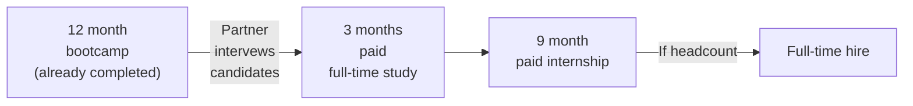
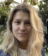
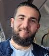
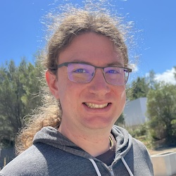
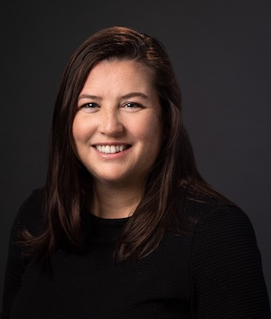
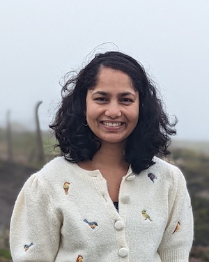
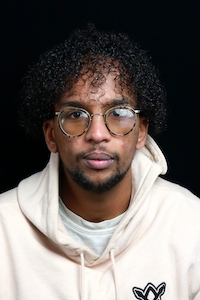

# Partnerships

CYF+ is an immersive education programme involving guided independent study and a work placement.

The core offering of CYF+ is to de-risk hiring high-potential junior engineers from diverse backgrounds into high-impact jobs.

We partner with top-of-industry tech companies to hire excellent diverse and disadvantaged people into junior roles where they thrive.

Previously we have run this programme to train software-engineering focused SREs, and we can support other software- and data-engineering focused roles.

## Who is Code Your Future?

[Code Your Future](https://codeyourfuture.io/) is an established charity based primarily in the UK providing a year-long part-time bootcamp to get disadvantaged people into good jobs in tech.

The CYF+ programme aims to take our top performing graduates and get them into the very top of the industry.

Code Your Future has already helped over 250 people start engineering careers. This is truly transformative for our graduates - 83% were below the poverty line, 41% are women, and we have a strong focus on refugees from countries such as Iran, Syria, Palestine, Turkey, Ukraine, Eritrea, and Afghanistan.

Our bootcamp has 70% employment rates within 6 months of graduation, and is proud to achieve 95% job retention after 2 years. People love hiring our graduates, and those graduates succeed.

## How CYF+ works

CYF+ recruits from the graduates of the main Code Your Future course - this means we know the existing knowledge of our trainees, and have established relationships with them.

We filter those graduates down to a number our hiring partner is happy to inteview, and the hiring partner decides who to accept into the programme.

Because of their backgrounds, our trainees typically have full-time jobs and caring responsibilities. Once they're accepted onto CYF+, we start paying them to be able to learn full-time.

Our trainees spend 3 months intensively learning skills specific to the jobs the hiring partner is offering.

After 3 months of learning, they start a 9 month internship at the hiring partner. They still get mentorship from their CYF mentors through this time to help them settle in, on-board, and succeed.

At the end of this 9 month internship, you're going to want to convert your interns to full-time, but you're not required to do so - if there's not head count available, that's ok - there are no promise made about long-term full-time jobs.

## What CYF+ offers

The core offering of CYF+ is to de-risk hiring high-potential junior engineers from diverse backgrounds into high-impact jobs.

CYF has significant experience with curriculum and project design, world-class talent as volunteers, and amazing mentors who know how to support people grow from wherever they are to where they need to be.

The CYF+ curriculum (which is open source) has been put together by experienced software engineers from the top of the industry with work experience at Google, Amazon, Twitter, Slack, Apple, and more, including [one of the co-authors of The Google SRE Book](https://www.linkedin.com/in/laura-nolan-bb7429/).

The broader CYF community includes professional curriculum developers and teachers, and mentors to hundreds of successful trainees.

Our aim is to transition from 100% CYF mentorship at the start of the programme, to partner-led mentorship by the time of full-time conversion. We have experienced mentors who will make sure the trainees are thriving, and we want to fold in hiring-partner mentors as early as possible. We can help your team to improve their mentorship skills as needed, and we act as a safety net to make sure the trainee is on a trajectory to success.

## What CYF+ teaches

CYF+ caters its curriculum to the needs of the specific hiring partner. In 2023 [we partnered with Slack](https://slack.com/intl/en-gb/blog/news/slack-cyf-plus-engineering-employment-pathways-refugees) to hire two SREs for their Demand Engineering team, so put together projects and material focusing on distributed systems thinking, troubleshooting, and handling scale and failure, as well as using Go as the main programming language. [You can see the content of the first run's course here](https://systems.codeyourfuture.io/versions/1-0-0/).

The course will always include:
* Quality code - making conscious decisions about what the best, most readable, most maintainable way to write code is.
* Distributed systems thinking - state, failure, reliability, etc.
* Working in existing codebases - understanding and debugging code they didn't write.
* Troubleshooting - how to work in an environment where many systems are black boxes you don't know the details of.
* Handling scale and failure - concurrency, error handling, retry strategies, sources of risk and failure.

Additionally we can tailor specific topics or projects to the specific needs of a company or team.

## What CYF+ needs from partners

* A collaborative attitude to understanding what knowledge and experience new-hires will need, and how best to supply them.
* A commitment to hire at least 2 excellent junior engineers on a 9-month internship, including paying their salary and providing a supportive mentoring environment.
* A contribution to Code Your Future of at least £20,000 per hire to support mentoring, training, and course development costs.

## CYF+'s track record

**100% successful employment**

CYF+ has run one cohort with Slack, where both participants were converted to full-time employees just 6 months into their internships.

"Hiring SREs is challenging, but this program enables us to cultivate a diverse talent pool. In my humble opinion, investing in such initiatives is the most reliable way to onboard junior engineers, with a high success rate on the job. These programs not only benefit candidates but also provide valuable mentorship and growth opportunities for our existing team, inspiring and motivating everyone involved. The CYF+ graduates we hired are thriving. We couldn’t be happier with the results." - [V Brennan](https://www.linkedin.com/in/vcbrennan/), Senior Director of Engineering, Slack

## Profiles

### Our graduates

[Watch a video of graduates presenting at SRECon23 EMEA about their experience with the course.](https://www.youtube.com/watch?v=bRatSl8BKGc)

<section class="c-person-profile">
  

  "CYF+ turned my life around by 180 degrees. What initially felt like a distant dream has now become my everyday reality. It was one of the biggest challenges I undertook, but every minute of it was a transformative experience to become a better, more knowledgeable, and confident software engineer. It opened doors to Big Tech and prepared me to work in a world where millions of requests flood every second. Through CYF+ I met the most amazing mentors, worked with advanced technologies, and presented at a conference. Thanks to CYF+ and everyone involved, I am finally living the life I always wanted!" - [Margarita Glushkova](https://www.linkedin.com/in/margarita-glushkova-894344105/)

  

</section>

<section class="c-person-profile">
  

  "I learned about CYF during a very difficult time in my life right at the peak of the pandemic, when I thought there was no hope. Almost 3 years later, I’m now working as a Site Reliability Engineer at Slack and it's all thanks to CYF, CYF+, and the amazing volunteers that work tirelessly to help students become engineers. For me, CodeYourFuture isn't just a bootcamp, it's a community where everyone is welcome regardless of their background or situation." - [Berkeli Halmyradov](https://www.linkedin.com/in/berkeli/)

  

</section>

### Some of our volunteers

<section class="c-person-profile">
  

  [Daniel Wagner-Hall](https://github.com/illicitonion) acts as a mentor for the trainees on the course, as well as helping to create course content. He's been a volunteer with CYF since 2020, and has worked at companies like Google, Twitter, and Apple. He's developed systems that reliably serve millions of queries per second, maintains [several](https://github.com/bazelbuild/rules_rust) [significant](https://crates.io/crates/num_enum) [open](https://www.selenium.dev/project/structure/#selenium_committers) [source](https://github.com/bazel-contrib/target-determinator) [projects](https://www.pantsbuild.org/docs/team), and loves to help people grow.
  

</section>

<section class="c-person-profile">
  

  [Laura Nolan](https://www.linkedin.com/in/laura-nolan-bb7429/) is a principal software engineer, known for writing and speaking about Site Reliability Engineering (SRE) and software operations topics. She is a contributor to [the O'Reilly Site Reliability Engineering book](https://www.oreilly.com/library/view/site-reliability-engineering/9781491929117/), and contributes her knowledge to developing the CYF+ curriculum as well as mentoring trainees on the course.

  Laura initially worked with CYF as part of her former role at Slack, but CYF impressed her so much with its sheer efficiency and focus on its mission to diversify tech that she stayed as a volunteer.
  

</section>

<section class="c-person-profile">
  

  My name is [Radha Kumari](https://www.linkedin.com/in/kumari-radha-a3419b25/) and I'm a Staff Software Engineer at Slack. I'm part of the Demand Engineering Team, responsible for all of Slack's ingress Traffic and how internal services interact with each other.

  I have had the privilege of working alongside some amazing human beings in designing this innovative and unique course aimed at teaching infrastructure and Site Reliability Engineering (SRE) skills to Refugees and low-income people. Mentoring individuals through this program and witnessing their growth has been incredibly rewarding, reinforcing my belief in the transformative power of education and mentorship.

  

</section>

<section class="c-person-profile">
  

  [Abdirizak Mohamed](https://www.linkedin.com/in/abdirizak-mohamed-63778117b/) is a software engineer who has worked for several companies, including Zoopla and most recently Amazon. At Amazon, he works on improving the resiliency of the Prime Video platform, including owning a project to automate the management of assets required for widely distributed load tests.

  Abdirizak has been with CYF for several years, primarily delivering course content during weekly classes, buddying with trainees, and providing feedback on coursework. For CYF+ he supports trainees by holding office hours and reviewing exercise submissions.

  

</section>

